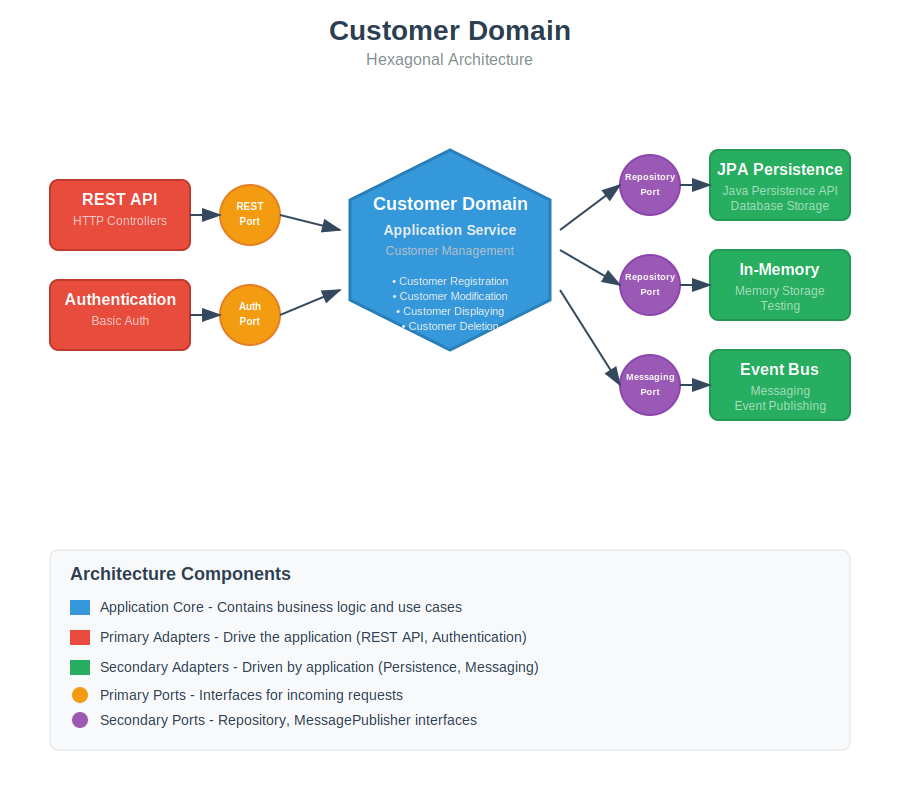

# Spring-Boot - Ports-And-Adapters / Hexagonal Architecture with DDD

|Build Status|License|
|------------|-------|
|[](https://github.com/hirannor/springboot-hexagonal-ddd/actions/workflows/maven.yml)|[](https://opensource.org/licenses/MIT)|


## Overview

This project is a **Spring Boot** example implementing **Ports & Adapters / Hexagonal Architecture** with **Domain-Driven Design (DDD)** principles.

The architecture enforces separation of concerns:

* **Domain Layer:** Pure business logic, framework-agnostic.
* **Application Layer:** Orchestrates use cases and mediates between domain and adapters.
* **Adapters / Infrastructure Layer:** Implements technical concerns such as messaging, persistence, and external APIs.

Architectural rules are validated using **[ArchUnit](https://www.archunit.org/)** to maintain a clean and consistent project structure.


## 🛠 Tech Stack


## Architecture Overview



Key principles enforced via ArchUnit tests:

* Dependency rules between layers (Domain → Application → Adapters).
* Isolation of Domain Layer from frameworks.
* Compliance with naming conventions and package structure.

Running these tests ensures **architectural integrity** as the project evolves.


## Getting Started

### Prerequisites

* [Git](https://git-scm.com/downloads)
* [JDK 21](https://adoptium.net/)
* [Maven](https://maven.apache.org/download.cgi)
* [Docker Desktop](https://www.docker.com/products/docker-desktop/)

### Quick Start

1. Clone the repository:

```bash
git clone https://github.com/hirannor/springboot-hexagonal-ddd.git
cd springboot-hexagonal-ddd
```

2. Start the PostgreSQL database with Docker:

```bash
docker-compose up -d
```

3. Build and run tests:

```bash
mvn clean verify
```

***Note:*** Some tests use **Testcontainers**, so Docker must be running.


## Implementing a New Adapter

Adapters are **explicitly configured**—the application excludes scanning the entire adapter package to avoid loading unnecessary beans.

* Each adapter defines its own Spring configuration class.
* Classes are imported via **@Import** on the main application class.
* Component scanning occurs **only if conditions are met** via **@ConditionalOnProperty**.

### Example: JWT Auth Adapter

```java
@Configuration
@ComponentScan
@ConditionalOnProperty(
        value = "adapter.authentication",
        havingValue = "jwt"
)
public class JwtAuthenticationConfiguration {
}

```

```yaml
# application-[profile].yml
adapter:
  authentication: # jwt
  persistence: # spring-data-jpa | in-memory
  notification: # sms | email
  messaging: # spring-event-bus
  web: # rest
```

## Testing

### Test Catalog and Maven Lifecycle

|     Test Type    | Maven Lifecycle |
| :--------------: | :-------------: |
|     Unit test    |       test      |
|  Component test  |       test      |
|   ArchUnit test  |       test      |
| Integration test |      verify     |


## API Documentation

* Accessible locally at: [http://localhost:8080/swagger-ui/index.html](http://localhost:8080/swagger-ui/index.html)

## Docker Setup

* **File:** `docker-compose.yml`
* **Environment variables:** stored in `.env`

Start the database:

```bash
docker-compose up -d
```
