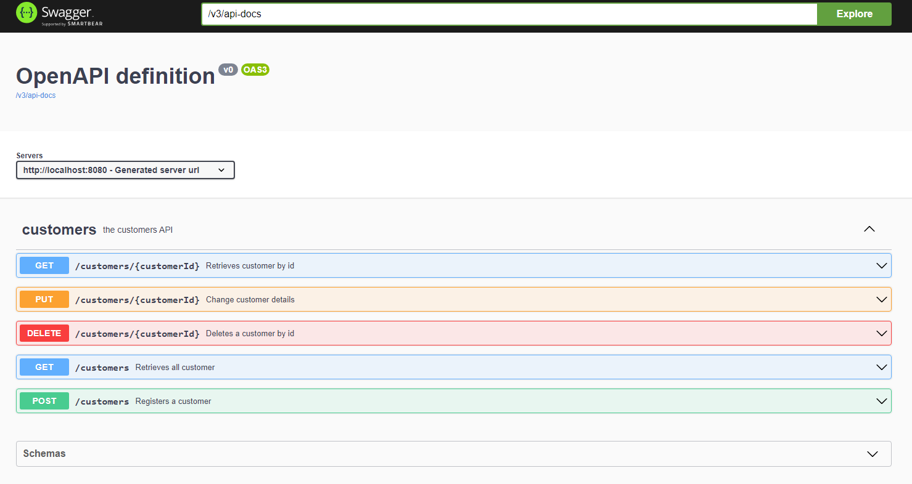

# Spring-Boot - Ports-And-Adapters / Hexagonal Architecture with DDD


|Build Status|License|
|------------|-------|
|[](https://github.com/hirannor/springboot-hexagonal-ddd/actions/workflows/maven.yml)|[](https://opensource.org/licenses/MIT)|


## Overview

An example of a Spring Boot application following **Port & Adapters / Hexagonal Architecture** and **Domain-Driven Design (DDD)** principles.

This project enforces architectural rules using **[ArchUnit](https://www.archunit.org/)** to maintain a clean and consistent structure:

- **Domain Layer** contains pure business logic and **does not depend** on any external frameworks or infrastructure.
- **Application Layer** orchestrates use cases and mediates between domain objects and external adapters.
- **Adapters / Infrastructure Layer** implements technical details such as messaging, databases, and external APIs.

## Architecture


### ArchUnit Tests

All core architectural rules are enforced via ArchUnit tests, including:

- Dependency rules between layers (Domain → Application → Adapters).
- Layer isolation (Domain is framework-agnostic).
- Naming conventions and package structure compliance.

Running the tests ensures that any violations of these rules are detected early during development, keeping the architecture **structurally sound** as the project evolves.

## Prerequisites for development

- [Git](https://git-scm.com/downloads)
- [JDK 21](https://adoptium.net/)
- [Maven](https://maven.apache.org/download.cgi)
- [Docker Desktop](https://www.docker.com/products/docker-desktop/)

## Implementing a new adapter

In the application the whole component scan for the adapter package is excluded, so the unnecessary adapter beans won't be loaded into the application context, just the configured ones.
Each adapter defines her own spring configuration class, which is imported via the **@Import** annotation (on top of the application's main class) but only those get component scanned where the condition(s) fulfills for it via **@ConditionalOnProperty** annotation.

Based on the below example if you define "spring-data-jpa" value as a persistence adapter in the application-[profile].yml, 
then it will activate the corresponding Configuration class, which is going to component scan the underlying packages for spring beans.

### Example

```java
@Configuration
@EnableJpaRepositories
@ComponentScan
@ConditionalOnProperty(
        value = "adapter.persistence",
        havingValue = "spring-data-jpa"
)
public class JpaPersistenceConfiguration {

}
```

application-[profile].yml
```YAML
adapter:
  authentication: # basic | jwt
  persistence: # spring-data-jpa | in-memory
  messaging: # spring-event-bus
  web: # rest
```

## Build and test with Maven
```
mvn clean verify
```

***Important:*** Building and verifying the application requires a running docker, since some tests are using
Testcontainers library!


### Test catalog and Maven lifecycle bindings

| Test catalog type | Maven lifecycle |
|:-----------------:|:---------------:|
|     Unit test     |      test       |
|  Component test   |      test       |
|   ArchUnit test   |      test       |
| Integration test  |     verify      |


## Docker Setup

A **Docker Compose** file is included in the project folder to run a PostgreSQL database.

- **File:** `docker-compose.yml`
- **Database credentials and name** are stored in the `.env` file.

Start the database with:

```bash
docker-compose up -d
```

## API Documentation
You can access the API documentation locally at the following URL:

[http://localhost:8080/swagger-ui/index.html](http://localhost:8080/swagger-ui/index.html)


